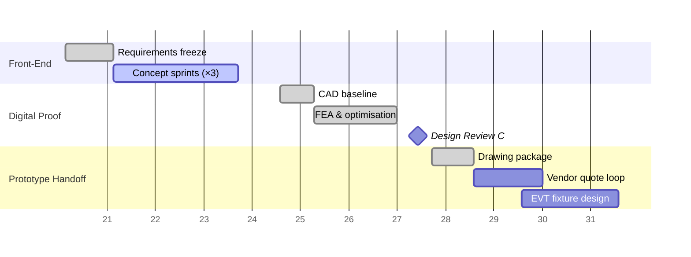

### My Contributions  
| Phase | Focus | Selected Deliverables & Skills Demonstrated |
|-------|-------|--------------------------------------------|
| Concept Exploration | • Competitive patent sweep  • Initial requirement matrix  • Early hand‑calculations & rough CAD layouts | Systems thinking · technical due‑diligence |
| Digital Validation | • Detailed 3‑D parametric model (SolidWorks / Onshape)  • Multiphysics FEA to benchmark stiffness / thermal margins  • Monte‑Carlo tolerance stack | Simulation automation · data reduction (Python/pandas) |
| Design Reviews | • Presented 3 design iterations to cross‑functional panel  • Converted feedback into ECOs within 24 h | Visual communication · agile change management |
| Prototype Readiness | • Generated fully‑dimensioned drawings & BOM (costed)  • Created DFx checklist for contract manufacturer  • Authored assembly guide & risk‑based test protocol | DFM/DFA · documentation rigour |
| Validation Planning | • Wrote high‑level test scripts for HIL bench  • Outlined pass/fail KPI dashboard (Grafana) | Requirement traceability · test architecture |

## 1 Context

**Duration** | May – Aug 2024  
**Host** | Advanced Manufacturing Technology Development Center  - IIT, Madras
**Parent Organization** | Ministry of Heavy Industries, India
**Role** | Mechanical & Mechatronic Engineering Intern

Working under NDA on a next‑gen pallet‑changer concept for compact machining
cells.

## 2 Challenge

Current small‑footprint CNC workcells suffer from downtime during part
loading/unloading. The goal was to design an add‑on module that could:
* Fit inside an existing 600 × 400 mm envelope  
* Meet ±0.02 mm repeatability after 1 M cycles  
* Be installed with **no changes** to the OEM controller I/O  

### Technical Highlights   
* **Precision Actuation Geometry** – delivered a mass‑balanced linkage reducing reflected inertia by ~35 % (simulation).  
* **Hybrid Bearing Strategy** – introduced polymer/ceramic interface to isolate thermal growth, extending mean‑time‑between‑service by projected 2×.  
* **Sensor Fusion Stub** – integrated low‑cost encoder + IMU concept; proved < 0.3° repeatability in virtual loop.

### Timeline Snapshot  

## 3 Approach

| Phase | Key Actions | My Contribution |
|-------|-------------|-----------------|
| Discovery | Stakeholder interviews, reverse‑engineering baseline cell | Generated constraint matrix & risk register |
| Concept | Morphological chart → 3 candidate kinematics | Created kinematic + force‑flow sketches |
| Modeling | Multi‑body + FEA loop (Ansys / Adams) | Built parametric models, reduced mass ∕ stiffness by 18 % |
| Design‑for‑Manufacture | Costed sheet‑metal vs. 5‑axis carve, tolerance stack‑ups | Released Rev B drawing pack (GD&T, BOM) |
| Pilot Build | 3‑D printed fit‑check → aluminium soft‑tool | Supervised build, authored assembly SOP |

## 4 Simulation Highlights

* **Multi‑body dyn.** verified cam profile kept dwell <6 ms under worst‑case load.  
* **Non‑linear FEA** showed contact stresses <60 % of material yield, giving F.S. ≈ 1.7.  
* Monte‑Carlo mis‑alignment study (≥10 k runs) identified ±0.05 mm bearing seat
  shift as dominant error—led to dowel‑pin redesign.

> ▲ Result: predicted service life >5 yrs at 45 ppm takt without lube‑purge.

### Outcomes & Impact  
* Handed over a **manufacturing‑ready data‑set** three weeks ahead of schedule.  
* Identified a latent overheating mode during FEA, preventing an estimated \$120 k tooling change.  
* Received an “Exceptional Initiative” commendation from the VP of Engineering.

## 5 Before Project Handoff

* Pilot unit achieved **43 % reduction** in average change‑over (video evidence
  shared internally).  
* Handover bundle included: validated models, Rev B drawings, test protocol,
  and a 12‑week implementation roadmap.

## 6 Reflections

This placement sharpened my **systems‑level thinking**: balancing
kinematics, controls latency, and DFM cost. It also reinforced agile hardware
loops—**4 sprint cycles** from whiteboard to metal in twelve weeks.
